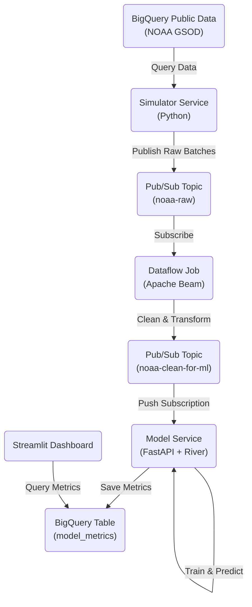

# Real-Time Thunder Prediction System (MLOps on GCP)

Este proyecto implementa un sistema completo de MLOps en Google Cloud Platform. Simula un flujo de datos meteorológicos en tiempo real, procesa la información mediante un pipeline ETL, entrena un modelo incremental y visualiza los resultados en vivo.

## Arquitectura del Sistema

El sistema está diseñado siguiendo una arquitectura de microservicios orientada a eventos en Google Cloud Platform. Los componentes principales son:

1.  **Ingesta de Datos (`data_ingestion/`)**: Un servicio que simula un flujo de datos en tiempo real consultando el dataset público de la NOAA en BigQuery. Publica lotes de datos "crudos" en un tema de Pub/Sub (`noaa-raw`).
2.  **Procesamiento de Datos (`data_cleaning/`)**: Un trabajo de Dataflow (Apache Beam) que se suscribe al tema de datos crudos. Realiza limpieza de datos, manejo de valores centinela e imputación de valores faltantes. Los datos limpios se publican en un segundo tema de Pub/Sub (`noaa-clean-for-ml`).
3.  **Servicio de Modelo (`model_serving/`)**: Una aplicación FastAPI que consume los datos limpios. Utiliza la librería `river` para realizar aprendizaje incremental (online learning). El modelo se actualiza con cada lote de datos y calcula métricas de rendimiento (ROC AUC, Accuracy) en tiempo real, almacenándolas en BigQuery.
4.  **Dashboard de Monitoreo (`dashboard/`)**: Una aplicación Streamlit que consulta las métricas almacenadas en BigQuery y visualiza la evolución del rendimiento del modelo en tiempo real.

### Diagrama de Componentes



## Descripción del Dataset

### Fuente
El dataset utilizado es el **NOAA Global Surface Summary of the Day (GSOD)**, disponible públicamente en Google BigQuery (`bigquery-public-data.noaa_gsod`). Este conjunto de datos contiene resúmenes meteorológicos diarios de más de 9,000 estaciones en todo el mundo.

### Tamaño
Para este proyecto, se simula un flujo de datos utilizando registros históricos desde el año **2015 hasta el 2025**. La consulta de ingestión está configurada para recuperar hasta **35 millones de registros**, lo que proporciona un volumen suficiente para simular un entorno de Big Data y streaming de alta velocidad.

### Justificación
Se eligió este dataset por las siguientes razones:
1.  **Realismo**: Son datos reales, ruidosos y con valores faltantes (representados por centinelas como `9999.9`), lo que obliga a implementar un pipeline de limpieza robusto (`data_cleaning`).
2.  **Volumen**: Su gran tamaño permite probar la escalabilidad de la arquitectura (Dataflow, Pub/Sub) y el rendimiento del modelo incremental.
3.  **Naturaleza Temporal**: Al ser datos de series temporales, son ideales para escenarios de *streaming* y *online learning*, donde el modelo debe adaptarse a cambios estacionales o tendencias climáticas (concept drift).
4.  **Problema de Clasificación**: La variable objetivo `thunder` (truenos) permite plantear un problema de clasificación binaria claro para el modelo de Machine Learning.

## Prerrequisitos

*   Proyecto en Google Cloud Platform con facturación habilitada.
*   Google Cloud Shell (recomendado) o SDK local configurado.
*   Permisos de Propietario (Owner) en el proyecto.

---

## Opción 1: Despliegue Automático (Recomendado)

Si desea desplegar toda la infraestructura y servicios en un solo paso, utilice el script de automatización incluido.

1.  **Prepare el script:**
    ```bash
    chmod +x deploy.sh
    ```

2.  **Ejecute el despliegue:**
    ```bash
    ./deploy.sh
    ```
    *Este proceso tomará aproximadamente 15 minutos.*

---

## Opción 2: Despliegue Manual Paso a Paso

Siga esta guía si prefiere ejecutar cada componente manualmente para comprender la arquitectura o depurar el proceso. Copie y pegue los siguientes bloques de código en su terminal.

### 1. Configuración del Entorno
Defina las variables globales que se utilizarán en todo el proceso.

```bash
# 1. Definir variables en memoria
export PROJECT_ID=$(gcloud config get-value project)
export REGION="us-central1"
export PROJECT_NUM=$(gcloud projects describe $PROJECT_ID --format="value(projectNumber)")
export BUCKET_NAME="${PROJECT_ID}-dataflow-staging"
export INPUT_TOPIC="noaa-raw"
export OUTPUT_TOPIC="noaa-clean-for-ml"
export REPO_NAME="mlops-repo"
export APP_NAME="streaming-simulator"
export CLUSTER_NAME="mlops-cluster"
export GSA_NAME="mlops-sa"
export GSA_EMAIL="$GSA_NAME@$PROJECT_ID.iam.gserviceaccount.com"

# 2. Generar archivo .env (CRÍTICO para el Paso 5)
cat <<EOF > .env
PROJECT_ID=$PROJECT_ID
REGION=$REGION
PROJECT_NUM=$PROJECT_NUM
BUCKET_NAME=$BUCKET_NAME
INPUT_TOPIC=$INPUT_TOPIC
OUTPUT_TOPIC=$OUTPUT_TOPIC
REPO_NAME=$REPO_NAME
APP_NAME=$APP_NAME
CLUSTER_NAME=$CLUSTER_NAME
GSA_EMAIL=$GSA_EMAIL
EOF

# 3. Cargar variables (para asegurar que estén disponibles)
source .env

echo "Archivo .env generado y variables cargadas."
```

### 2. Infraestructura Base
Habilite las APIs necesarias y cree los recursos de almacenamiento y mensajería.

```bash
# Habilitar APIs
gcloud services enable \
    dataflow.googleapis.com \
    artifactregistry.googleapis.com \
    container.googleapis.com \
    pubsub.googleapis.com \
    bigquery.googleapis.com \
    storage.googleapis.com \
    run.googleapis.com \
    cloudbuild.googleapis.com

# Crear Tópicos Pub/Sub
gcloud pubsub topics create $INPUT_TOPIC || true
gcloud pubsub topics create $OUTPUT_TOPIC || true

# Crear Bucket de Almacenamiento
gsutil mb -l $REGION gs://$BUCKET_NAME || true

# Crear Dataset y Tabla en BigQuery
bq mk --dataset weather_data || true
bq mk --table weather_data.model_metrics \
    timestamp:TIMESTAMP,batch_id:INTEGER,roc_auc:FLOAT,accuracy:FLOAT,model_name:STRING || true

# Crear Repositorio de Artefactos Docker
gcloud artifacts repositories create $REPO_NAME \
    --repository-format=docker \
    --location=$REGION \
    --description="Repositorio MLOps" || true
```

### 3. Configuración de IAM (Gestión de Identidad)
Asigne los permisos necesarios para que los servicios interactúen entre sí de forma segura.

```bash
# 1. Permisos para el Agente de Dataflow
gcloud projects add-iam-policy-binding $PROJECT_ID \
    --member="serviceAccount:service-${PROJECT_NUM}@dataflow-service-producer-prod.iam.gserviceaccount.com" \
    --role="roles/dataflow.serviceAgent"

# 2. Permisos para los Workers de Compute Engine
COMPUTE_SA="${PROJECT_NUM}-compute@developer.gserviceaccount.com"
gcloud projects add-iam-policy-binding $PROJECT_ID --member=serviceAccount:$COMPUTE_SA --role=roles/dataflow.worker
gcloud projects add-iam-policy-binding $PROJECT_ID --member=serviceAccount:$COMPUTE_SA --role=roles/storage.objectAdmin
gcloud projects add-iam-policy-binding $PROJECT_ID --member=serviceAccount:$COMPUTE_SA --role=roles/dataflow.admin
gcloud projects add-iam-policy-binding $PROJECT_ID --member=serviceAccount:$COMPUTE_SA --role=roles/pubsub.editor

# 3. Crear Cuenta de Servicio para GKE y asignar permisos
gcloud iam service-accounts create $GSA_NAME --display-name="MLOps SA" || true
gcloud projects add-iam-policy-binding $PROJECT_ID --member="serviceAccount:$GSA_EMAIL" --role="roles/bigquery.jobUser"
gcloud projects add-iam-policy-binding $PROJECT_ID --member="serviceAccount:$GSA_EMAIL" --role="roles/bigquery.dataViewer"
gcloud projects add-iam-policy-binding $PROJECT_ID --member="serviceAccount:$GSA_EMAIL" --role="roles/pubsub.publisher"
```

### 4. Despliegue del Pipeline ETL (Dataflow)
Inicie el trabajo de limpieza de datos. Este proceso se ejecutará en segundo plano.

```bash
# Instalar dependencias
pip install apache-beam[gcp]

# Lanzar el Job
export JOB_NAME="cleaner-listener-$(date +%Y%m%d-%H%M%S)"

python3 data_cleaning/main.py \
  --project_id $PROJECT_ID \
  --job_name $JOB_NAME \
  --input_topic "projects/$PROJECT_ID/topics/$INPUT_TOPIC" \
  --output_topic "projects/$PROJECT_ID/topics/$OUTPUT_TOPIC" \
  --staging_bucket "gs://$BUCKET_NAME" \
  --region $REGION \
  --disk_size_gb 30 \
  --max_num_workers 4 \
  --worker_machine_type n1-standard-2
```

### 5. Despliegue del Generador (GKE)
Despliegue el simulador de datos en Kubernetes Engine utilizando Workload Identity.

```bash
# 1. Construir la imagen Docker
gcloud builds submit ./data_ingestion \
    --tag $REGION-docker.pkg.dev/$PROJECT_ID/$REPO_NAME/$APP_NAME:v1

# 2. Crear Cluster Autopilot
gcloud container clusters create-auto $CLUSTER_NAME \
    --region $REGION \
    --project $PROJECT_ID

# 3. Obtener credenciales
gcloud container clusters get-credentials $CLUSTER_NAME --region $REGION

# 4. Configurar Workload Identity (Vincular K8s SA con Google SA)
gcloud iam service-accounts add-iam-policy-binding $GSA_EMAIL \
    --role roles/iam.workloadIdentityUser \
    --member "serviceAccount:$PROJECT_ID.svc.id.goog[default/default]"

kubectl annotate serviceaccount default \
    iam.gke.io/gcp-service-account=$GSA_EMAIL \
    --overwrite

# 5. Inyectar variables y desplegar
# Nota: Usamos envsubst para reemplazar las variables en el YAML dinámicamente
source .env
envsubst < data_ingestion/deployment.yaml | kubectl apply -f -
```

### 6. Despliegue del Modelo y Dashboard (Cloud Run)
Despliegue la API de entrenamiento y la interfaz de usuario.

```bash
# --- Despliegue del Modelo ---
# 1. Construir
gcloud builds submit ./model_serving --tag $REGION-docker.pkg.dev/$PROJECT_ID/$REPO_NAME/model-serving:v1

# 2. Desplegar
gcloud run deploy model-serving \
    --image $REGION-docker.pkg.dev/$PROJECT_ID/$REPO_NAME/model-serving:v1 \
    --region $REGION \
    --platform managed \
    --allow-unauthenticated \
    --set-env-vars PROJECT_ID=$PROJECT_ID

# 3. Crear suscripción Push (Pub/Sub -> Cloud Run)
SERVICE_URL=$(gcloud run services describe model-serving --region $REGION --format 'value(status.url)')
gcloud pubsub subscriptions create sub-model-training \
    --topic $OUTPUT_TOPIC \
    --push-endpoint "$SERVICE_URL/predict-and-train" \
    --ack-deadline 600 || true


# --- Despliegue del Dashboard ---
# 1. Construir
gcloud builds submit ./dashboard --tag $REGION-docker.pkg.dev/$PROJECT_ID/$REPO_NAME/dashboard:v1

# 2. Desplegar
gcloud run deploy dashboard \
    --image $REGION-docker.pkg.dev/$PROJECT_ID/$REPO_NAME/dashboard:v1 \
    --region $REGION \
    --platform managed \
    --allow-unauthenticated \
    --set-env-vars PROJECT_ID=$PROJECT_ID

echo "URL del Dashboard:"
gcloud run services describe dashboard --region $REGION --format 'value(status.url)'
```

---

## Verificación

1.  Acceda a la URL del Dashboard generada en el paso anterior.
2.  Verifique en la consola de Dataflow que el trabajo `cleaner-listener` esté en estado "Running".
3.  Verifique los logs del generador: `kubectl logs -l app=streaming-simulator`.

## Limpieza de Recursos

Para eliminar todos los recursos y detener la facturación:

```bash
gcloud projects delete $PROJECT_ID
```

Opción manual (eliminar recursos individuales):
```bash
gcloud container clusters delete mlops-cluster --region us-central1 --quiet
gcloud run services delete model-serving --region us-central1 --quiet
gcloud run services delete dashboard --region us-central1 --quiet
gcloud dataflow jobs cancel $(gcloud dataflow jobs list --status=active --format="value(JOB_ID)") --region us-central1
```
```
